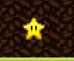

# 🕹️ Phaser 3
## 🖥️ Learn framework





* start dev: `yarn start`
* build prod: `yarn build`


#### if you want to start something lesson, you need to change string into `webpack.config.js` and rebuild project: 

```js
const lessonSelector = './Lesson_1/'; // target lesson folder
```

# 🕹️ Lessons: 

* `Lesson 1` - init project
* `Lesson 2` - start project. create scene. load assets. run game.
* `Lesson 3` - core mechanics.
* `Lesson 4` - creating the world. Ground. Collision.
* `Lesson 5` - stars collect  ⭐️️
* `Lesson 6` - add enemies


